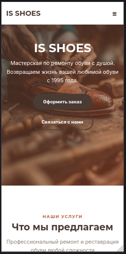
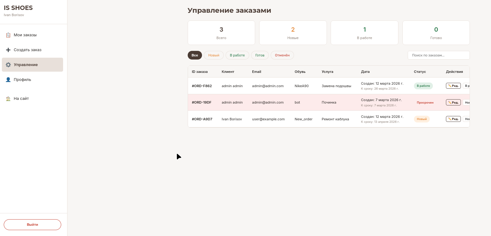
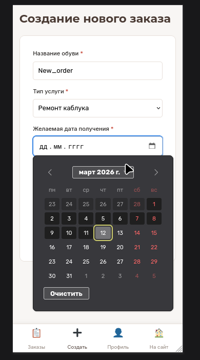

## 📘 IS SHOES — Мастерская по ремонту обуви

> Полнофункциональное веб-приложение для управления заказами в мастерской по ремонту обуви с разделением ролей (клиент, менеджер, администратор).

---

## 📸 Скриншоты

> ****

> ****

> ****

---

## 🚀 О проекте

**IS SHOES** — это современное SPA-приложение для автоматизации работы мастерской по ремонту обуви. Проект реализован на стеке React + TypeScript (фронтенд) и FastAPI + PostgreSQL (бэкенд), упакован в Docker-контейнеры для простого развертывания.

### Ключевые возможности

- **Регистрация и авторизация** с JWT-токенами
- **Три роли пользователей**: клиент, менеджер, администратор
- **Создание и просмотр заказов** для клиентов
- **Управление заказами** (статусы, редактирование, удаление) для менеджеров и админов
- **Адаптивный дизайн** для мобильных устройств (390×844)
- **Темная/светлая тема** в стиле мастерской

---

## 🛠 Технологический стек

### Бэкенд
- **Python 3.12** + **FastAPI** — высокопроизводительный фреймворк
- **SQLAlchemy** + **Alembic** — ORM и миграции
- **PostgreSQL 15** — база данных
- **JWT** — аутентификация
- **Pydantic** — валидация данных
- **Poetry** — управление зависимостями
- **Docker** + **Docker Compose** — контейнеризация

### Фронтенд
- **React 18** + **TypeScript** — пользовательский интерфейс
- **Vite** — быстрая сборка
- **Bun** — пакетный менеджер
- **React Router DOM v6** — маршрутизация
- **Чистый CSS** + **CSS-переменные** — стилизация (без Tailwind)
- **Адаптивная верстка** (mobile-first)

---

## 📁 Структура проекта

```
IS_Shoes/
├── backend/                 # Бэкенд на FastAPI
│   ├── app/
│   │   ├── api/             # Роуты (auth, orders, admin)
│   │   ├── core/            # Конфигурация, безопасность
│   │   ├── models/          # SQLAlchemy модели
│   │   ├── schemas/         # Pydantic схемы
│   │   └── db/              # Подключение к БД
│   ├── alembic/             # Миграции
│   ├── scripts/             # Скрипты (seed_db.py)
│   ├── pyproject.toml       # Зависимости Poetry
│   └── Dockerfile
│
├── frontend/                # Фронтенд на React
│   ├── src/
│   │   ├── components/      # Переиспользуемые компоненты
│   │   ├── pages/           # Страницы приложения
│   │   ├── contexts/        # React контексты
│   │   ├── services/        # API сервисы
│   │   ├── types/           # TypeScript типы
│   │   ├── assets/          # Изображения
│   │   ├── AppRouter.tsx    # Маршрутизация
│   │   └── index.css        # Глобальные стили
│   ├── package.json
│   ├── vite.config.ts
│   └── Dockerfile
│
├── docker-compose.yml       # Оркестрация всех сервисов
└── .env.example             # Пример переменных окружения
```

---

## 🗄️ Модели данных

### Роли (roles)
| Поле | Тип | Описание |
|------|-----|----------|
| id | Integer | Первичный ключ |
| name | String | Уникальное имя роли (admin, manager, client) |
| description | String | Описание роли |

### Пользователи (users)
| Поле | Тип | Описание |
|------|-----|----------|
| id | Integer | Первичный ключ |
| role_id | ForeignKey | Связь с roles |
| client_id | String | Уникальный ID клиента |
| name | String | Имя |
| surname | String | Фамилия |
| email | String | Email (логин) |
| phone | String | Телефон |
| hashed_password | String | Хеш пароля |
| date_registration | DateTime | Дата регистрации |

### Заказы (orders)
| Поле | Тип | Описание |
|------|-----|----------|
| id | Integer | Первичный ключ |
| order_id | String | Уникальный ID заказа |
| client_id | ForeignKey | Связь с users |
| shoes_name | String | Название обуви |
| description | String | Описание проблемы |
| service_type | String | Тип услуги |
| desired_date | Date | Желаемая дата |
| status | Enum | new, in_progress, done, cancelled |
| date_created | DateTime | Дата создания |
| date_updated | DateTime | Дата обновления |

> **[ВСТАВИТЬ ER-ДИАГРАММУ БАЗЫ ДАННЫХ]**

---

## 🔐 Функционал по ролям

### 👤 Клиент
- Регистрация и вход в систему
- Просмотр списка своих заказов
- Фильтрация заказов по статусу
- Создание нового заказа
- Просмотр профиля

### 👨‍💼 Менеджер
- Всё, что доступно клиенту
- Просмотр всех заказов всех клиентов
- Изменение статуса любого заказа
- Редактирование деталей заказа

### 👑 Администратор
- Всё, что доступно менеджеру
- Удаление заказов

---

## 🚦 Маршруты фронтенда

| Путь | Доступ | Описание |
|------|--------|----------|
| `/` | Все | Главная страница (лендинг) |
| `/login` | Гости | Вход в систему |
| `/register` | Гости | Регистрация |
| `/dashboard` | Авторизованные | Корень дашборда |
| `/dashboard/my-orders` | Авторизованные | Мои заказы |
| `/dashboard/create-order` | Авторизованные | Создание заказа |
| `/dashboard/profile` | Авторизованные | Профиль пользователя |
| `/dashboard/manage-orders` | Admin/Manager | Управление всеми заказами |

---

## 📡 API Endpoints

### Аутентификация (`/auth`)
| Метод | Эндпоинт | Описание |
|-------|----------|----------|
| POST | `/auth/register` | Регистрация нового пользователя |
| POST | `/auth/login` | Вход (возвращает JWT) |
| GET | `/users/me` | Данные текущего пользователя |

### Заказы (`/orders`)
| Метод | Эндпоинт | Описание |
|-------|----------|----------|
| POST | `/orders/` | Создание заказа |
| GET | `/orders/me` | Заказы текущего пользователя |

### Администрирование (`/admin/orders`)
| Метод | Эндпоинт | Описание | Доступ |
|-------|----------|----------|--------|
| GET | `/admin/orders/` | Все заказы | Admin/Manager |
| PATCH | `/admin/orders/{id}/status` | Изменение статуса | Admin/Manager |
| PUT | `/admin/orders/{id}` | Полное редактирование | Admin/Manager |
| DELETE | `/admin/orders/{id}` | Удаление заказа | Только Admin |

---

## 🎨 Дизайн-система

Проект использует CSS-переменные для единой стилизации:

```css
:root {
  /* Цвета бренда */
  --primary: #4A3B34;        /* Глубокий какао */
  --accent: #B85C3A;         /* Кожаная ржавчина */
  --background: #F8F6F4;     /* Мел */
  --card: #FFFFFF;           /* Белый */
  --border: #E8E0DA;         /* Границы */
  --text-muted: #8C7F76;     /* Второстепенный текст */
  
  /* Статусы */
  --success: #2B7A4B;
  --warning: #E68A3A;
  --error: #C33C2C;
  
  /* Типографика */
  --font-display: 'Montserrat', 'Playfair Display', serif;
  --font-body: 'Inter', sans-serif;
  
  /* Отступы */
  --space-1: 4px;   --space-2: 8px;   --space-3: 12px;
  --space-4: 16px;  --space-6: 24px;  --space-8: 32px;
}
```

---

## 🚀 Быстрый старт

### Предварительные требования
- **Docker** и **Docker Compose**
- **Git**

### Установка и запуск

```bash
# 1. Клонирование репозитория
git clone https://github.com/yourusername/IS_Shoes.git
cd IS_Shoes

# 2. Создание файла окружения
cp .env.example .env
# Отредактируйте .env, установите свои пароли

# 3. Запуск всех сервисов
docker-compose up --build
```

После успешного запуска:
- **Фронтенд**: http://localhost:5173
- **Бэкенд API**: http://localhost:8000
- **Документация API**: http://localhost:8000/docs

### Учетные данные по умолчанию

| Роль | Email | Пароль |
|------|-------|--------|
| Администратор | admin@admin.com | admin |
| Менеджер | manager@example.com | manager123 |
| Клиент | client@example.com | client123 |

> **Примечание**: Менеджер и клиент создаются через регистрацию, админ создается автоматически при первом запуске.

---

## 👨‍💻 Разработка

### Бэкенд

```bash
# Войти в контейнер
docker-compose exec backend bash

# Создать миграцию
poetry run alembic revision --autogenerate -m "description"

# Применить миграцию
poetry run alembic upgrade head

# Создать админа вручную (если не сработал авто-скрипт)
poetry run python scripts/seed_db.py
```

### Фронтенд

```bash
# Войти в контейнер
docker-compose exec frontend bash

# Установка зависимостей
bun install

# Запуск в режиме разработки
bun run dev

# Сборка для продакшена
bun run build
```

---

## 📱 Адаптивность

Приложение полностью адаптировано под мобильные устройства:

- **Десктоп** (>768px): боковое меню, горизонтальная навигация
- **Мобильные** (<768px): нижняя навигация с иконками, выезжающее меню

> ****

---

## 🔒 Безопасность

- Пароли хешируются с использованием **bcrypt**
- Аутентификация через **JWT-токены**
- Валидация данных на бэкенде через **Pydantic**
- Защита маршрутов на фронтенде через `ProtectedRoute`
- Разграничение доступа по ролям

---

## 📊 Типовой сценарий использования

### Клиент
1. Регистрируется на сайте
2. Входит в личный кабинет
3. Создает заказ на ремонт обуви
4. Отслеживает статус заказа в списке
5. При необходимости просматривает профиль

### Менеджер
1. Входит в систему
2. Переходит в раздел "Управление заказами"
3. Видит все заказы всех клиентов
4. Меняет статусы по мере выполнения работ
5. Редактирует детали заказов

### Администратор
1. Выполняет все функции менеджера
2. Может удалять заказы при необходимости

---

## 🧪 Тестирование

### Тестовые сценарии

1. **Регистрация нового пользователя**
   - Валидация полей (email, телефон, пароль)
   - Уникальность email

2. **Создание заказа**
   - Проверка обязательных полей
   - Дата не может быть в прошлом

3. **Работа с заказами**
   - Фильтрация по статусу
   - Изменение статуса менеджером
   - Удаление админом

4. **Адаптивность**
   - Проверка на мобильных устройствах (390×844)
   - Проверка десктопе

---

## 📄 Лицензия

MIT License. Свободно для использования в образовательных и коммерческих целях.

---

## 🤝 Вклад в проект

1. Форкните репозиторий
2. Создайте ветку для фичи (`git checkout -b feature/amazing-feature`)
3. Закоммитьте изменения (`git commit -m 'Add some amazing feature'`)
4. Запушьте в ветку (`git push origin feature/amazing-feature`)
5. Откройте Pull Request

---

## 📞 Контакты

По всем вопросам: dodrolla@gmail.com

---

> ****

---

**IS SHOES** — сделано с ❤️ для удобства мастеров и их клиентов.